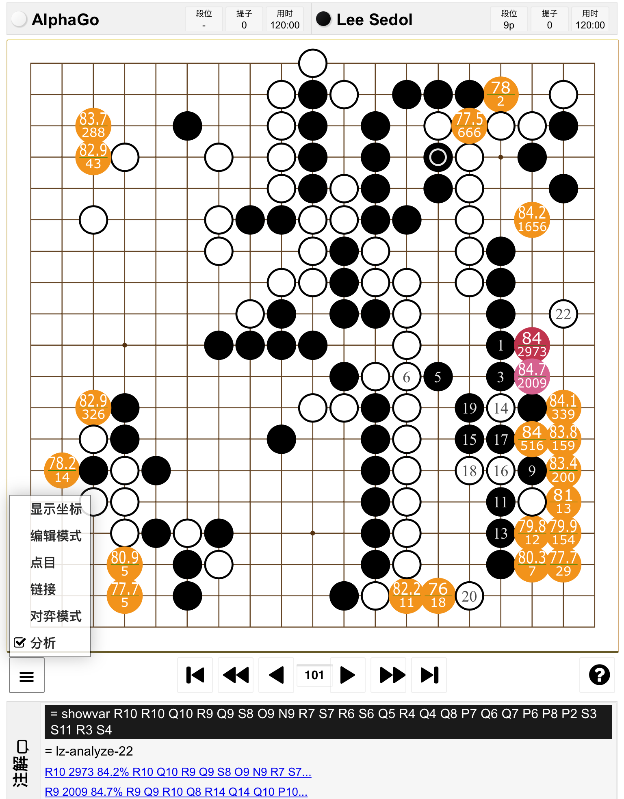

# Webgo

# Introduction
Using web browser to visit your computer which is running leela zero to analyse sgf.
So you can analyse all kifu anywhere.



# Dependency and acknowledge
1. Web page based on WGo.js.
2. Server side based on Leela Analysis Scripts and using python2.7
3. Server side also need Python module: bottle, gevent, gevent-websocket
4. Using some sabaki theme

# Server Installation
1. Install python 2.7
2. Install bottle, gevent, gevent-websocket
```
pip bottle
pip gevent
pip gevent-websocket
```
3. If you already have your web server, please skip this step

3.1 download nginx/1.2.8

3.2 modify nginx.conf and set the port and root path
```
server {
        listen       80;
        server_name  localhost;
        charset utf-8;
        location = / {
            root   C:\web;
            index  index.html index.php;
}
```
3.3 add sgf as one filetype permitted by server
```
location ~* \.(htm|html|gif|jpg|jpeg|png|css|js|ico|json|net|sgf)$ {
    root C:\web;
}
```
4. put all zip content to your web site root

In the example , it's ```c:\web```

# Server Configuration
In ```svr\webgo.py```, change to your own leelazero executable path and set the weight name correctly and make sure the leelaz.exe support lz-analyze gtp command
```
executable = "c:/go/leela-zero/leelaz.exe"
weight = '-wc:/go/weight/62b5417b64c46976795d10a6741801f15f857e5029681a42d02c9852097df4b9.gz'
```

# Sgf library
You can put sgf file under sgf directory

# How to run
server side, under cmd.exe run:
```
c:\python2.7\python webgo.py
```

browser side, can use pad/phone with any web browser
```
http://your_ip/webgo.html?sgf=1.sgf&move=50
```


# License

The code is released under the AGPLv3 or later.
* http://www.fsf.org/licensing/licenses/agpl-3.0.html